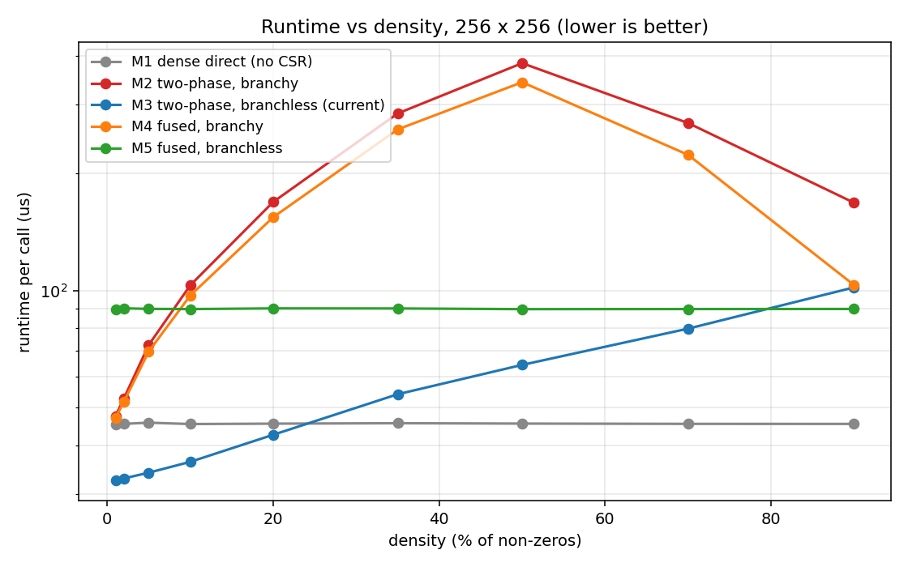
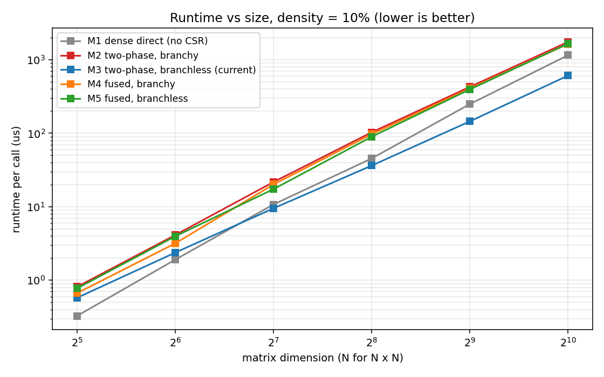
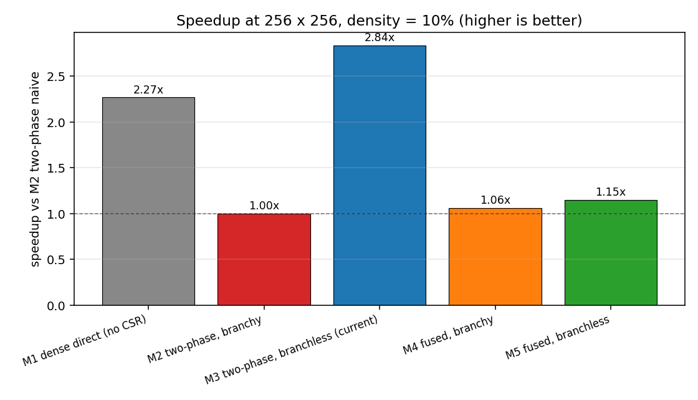
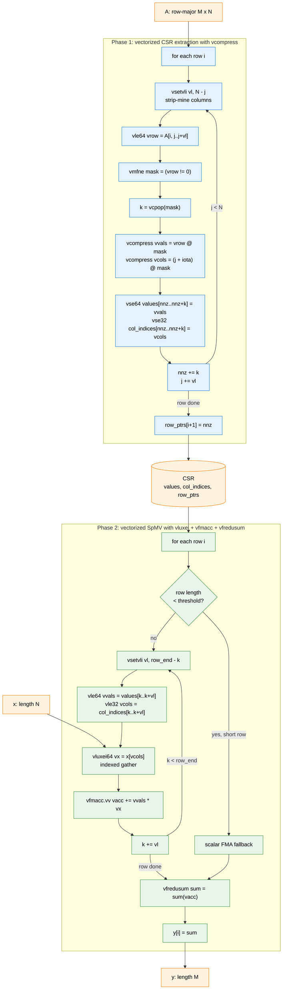

# RV-Sparse: `sparse_multiply`

Submission for the RV-Sparse coding challenge. Implements `sparse_multiply`,
which scans a dense row-major matrix `A`, extracts its non-zero elements
into Compressed Sparse Row (CSR) format, and computes `y = A * x`. All
buffers are caller-owned; the function performs zero dynamic allocation.

## Function

```c
void sparse_multiply(
    int rows, int cols, const double* A, const double* x,
    int* out_nnz, double* values, int* col_indices, int* row_ptrs,
    double* y);
```

The caller pre-allocates:

- `values`, `col_indices` with capacity `rows * cols` (worst-case `nnz`).
- `row_ptrs` with length `rows + 1`.
- `y` with length `rows`.

## Final implementation

The submitted version (`challenge.c`) is a two-phase implementation
with branchless CSR writes and `__restrict__`-qualified aliases that
let the compiler auto-SIMDize the dot-product loop under `-O3`.

## Five methods compared

| ID | Name                  | Phase 1 (extract)                      | Phase 2 (SpMV)              | restrict |
|----|-----------------------|----------------------------------------|-----------------------------|----------|
| M1 | dense direct          | (skipped, no CSR)                      | dense `y = A * x`           | no       |
| M2 | two-phase, branchy    | `if (v != 0)` store                    | walk CSR                    | no       |
| M3 | two-phase, branchless | predicated `nnz += (v != 0)` store     | walk CSR                    | yes      |
| M4 | fused, branchy        | `if (v != 0)` store and accumulate `s` | (merged into Phase 1)       | no       |
| M5 | fused, branchless     | predicated store with dense FMA on `s` | (merged, FMA over all j)    | yes      |

M1 does not actually build CSR and exists only as a theoretical floor.
M2 is the textbook implementation. M3 is the submission. M4 and M5
fuse the two phases to test whether locality outweighs the branch.

### M1, dense direct

```c
for (i)
    for (j) s += A[i*cols + j] * x[j];
```

Pure dense product. Sets the upper bound on FMA throughput regardless
of density.

### M2, two-phase, branchy

```c
for (i) {
    row_ptrs[i] = nnz;
    for (j) if (A[i*cols+j] != 0.0) { values[nnz]=...; col_indices[nnz]=j; ++nnz; }
}
for (i) {
    double s = 0;
    for (k = row_ptrs[i]; k < row_ptrs[i+1]; ++k) s += values[k] * x[col_indices[k]];
    y[i] = s;
}
```

The `if (v != 0.0)` is a data-dependent branch. At intermediate
densities (around 35 to 50%) it mispredicts close to half the time.

### M3, two-phase, branchless (submission)

```c
for (i) {
    pr[i] = nnz;
    for (j) {
        double v = row[j];
        pv[nnz] = v;
        pc[nnz] = j;
        nnz += (v != 0.0);     // compiler emits cmov
    }
}
// Phase 2 identical to M2 but pointers are __restrict__.
```

Two improvements over M2:

1. The conditional store becomes an unconditional store plus a
   conditional cursor advance (`cmov`), eliminating the inner branch.
2. `__restrict__` aliases let the compiler vectorize
   `s += pv[k] * px[pc[k]]` into a SIMD gather plus FMA without
   runtime alias checks.

### M4, fused, branchy

```c
for (i) {
    double s = 0; pr[i] = nnz;
    for (j) {
        double v = row[j];
        if (v != 0.0) { pv[nnz]=v; pc[nnz]=j; ++nnz; s += v * x[j]; }
    }
    py[i] = s;
}
```

Walks `values[]` exactly once but keeps the branch.

### M5, fused, branchless

```c
for (i) {
    double s = 0; pr[i] = nnz;
    for (j) {
        double v = row[j];
        pv[nnz] = v; pc[nnz] = j;
        nnz += (v != 0.0);
        s   += v * px[j];      // FMA on every j; v=0 contributes 0
    }
    py[i] = s;
}
```

Branch-free, but the inner loop now does dense work per cell.

## Complexity (per call)

| Method | A reads     | values writes              | values reads | FMAs        |
|--------|-------------|----------------------------|--------------|-------------|
| M1     | rows * cols | 0                          | 0            | rows * cols |
| M2     | rows * cols | nnz                        | nnz          | nnz         |
| M3     | rows * cols | rows * cols (predicated)   | nnz          | nnz         |
| M4     | rows * cols | nnz                        | 0            | nnz         |
| M5     | rows * cols | rows * cols (predicated)   | 0            | rows * cols |

M3 trades a few extra silent writes for branch elimination. M5
performs the same FLOPs as M1 plus the CSR write traffic.

## Empirical results

Apple M1 Max, Apple clang 17, `-O3 -march=native -lm`. For each
configuration, iteration count is auto-calibrated until the kernel
runs for at least 50 ms; we report the best of 5 trials.

### Runtime vs density at 256 x 256



| density | M1     | M2      | M3     | M4      | M5     |
|---------|--------|---------|--------|---------|--------|
| 1%      | 45 us  | 47 us   | 33 us  | 47 us   | 89 us  |
| 10%     | 45 us  | 103 us  | 36 us  | 97 us   | 90 us  |
| 35%     | 46 us  | 285 us  | 54 us  | 259 us  | 90 us  |
| 50%     | 46 us  | 383 us  | 64 us  | 342 us  | 90 us  |
| 70%     | 45 us  | 269 us  | 80 us  | 223 us  | 90 us  |
| 90%     | 45 us  | 168 us  | 102 us | 103 us  | 90 us  |

Observations:

- M1 is flat. It does not care about density.
- M3 is the fastest across the entire sparse regime (density <= 70%).
- M2 and M4 peak between 35% and 50% density, where branch prediction
  is worst, costing 5x to 9x over M3.
- M5 is essentially flat (dense FMA traffic regardless of density).
  It overtakes M3 only at density above 85%, which is no longer
  "sparse".

### Runtime vs N at density 10% (N x N matrices)



| N    | M1       | M2        | M3       | M4        | M5        |
|------|----------|-----------|----------|-----------|-----------|
| 32   | 0.3 us   | 0.8 us    | 0.6 us   | 0.7 us    | 0.8 us    |
| 64   | 1.9 us   | 4.1 us    | 2.4 us   | 3.2 us    | 4.0 us    |
| 128  | 10.7 us  | 21.7 us   | 9.5 us   | 20.1 us   | 17.4 us   |
| 256  | 45.4 us  | 103.1 us  | 36.3 us  | 97.0 us   | 89.6 us   |
| 512  | 249.6 us | 427.8 us  | 145.2 us | 405.9 us  | 395.4 us  |
| 1024 | 1.15 ms  | 1.75 ms   | 0.61 ms  | 1.64 ms   | 1.66 ms   |

M3 holds a 2x to 3x lead over M2 across all sizes. The gap widens
at 1024 x 1024 because the SIMD gather plus FMA in Phase 2 scales
well while the branchy variants do not.

### Speedup vs M2 at 256 x 256, density 10%



M3 is **2.84x** faster than M2 in the realistic sparse regime.

## Why M3 wins

Two effects compound:

1. **Branch elimination.** At 5% to 50% density, the data-dependent
   branch in M2 and M4 mispredicts often enough to dominate runtime.
   `nnz += (v != 0.0)` lets the compiler emit `cmov`, removing the
   misprediction.
2. **restrict-enabled SIMD.** The Phase 2 inner loop
   `s += pv[k] * px[pc[k]]` becomes a tight SIMD gather plus FMA when
   the pointers are tagged `__restrict__`. M2 cannot vectorize the
   same loop without runtime alias checks.

The fused single-pass methods (M4, M5) lose to M3 because:

- Phase 1 in M3 is a clean streaming scan, friendly to the prefetcher.
- M3 Phase 2 has a short working set proportional to `nnz`, not
  `rows * cols`.
- Modern out-of-order cores hide the latency between phases, so
  fusing them yields no locality bonus.

## When to pick which

- General sparse, density `<= 70%`: M3 (the submission).
- Density `>= 85%`: M5, though CSR is no longer the right format.
- No CSR needed: M1.

## Future work: SOTA flow with RVV intrinsics

The `rv-sparse` project targets RISC-V Vector hardware. Beyond plain
C, the kernels would be replaced with vector-length-agnostic RVV
intrinsics. The diagram below shows the data path and the key
instructions that fire on each pass.



Highlights:

- **Phase 1** turns the branchy `if (v != 0)` of M3 into a single
  `vmfne` mask plus a `vcompress`. One vector pass per `vl` columns
  emits both `values[]` and `col_indices[]` with no per-element
  branching.
- **Phase 2** loads contiguous CSR slices, gathers `x` through
  `vluxei64`, and accumulates with `vfmacc.vv`. Each row ends with
  one `vfredusum`.
- A scalar fallback handles rows shorter than ~vl, since `vsetvli`
  and `vfredusum` overhead dominates very short rows.
- The whole pipeline stays vector-length-agnostic, so the same
  binary runs on a 128-bit `CanMV-K230` and a 256-bit `BananaPi F3`
  without recompilation.

This matches the plan described in
[merledu/rv-sparse Issue #1](https://github.com/merledu/rv-sparse/issues/1)
and the register-file and unrolling techniques in
[arXiv:2501.10189](https://arxiv.org/abs/2501.10189).

## Repository layout

```
.
├── challenge.c          # final submission (M3)
├── bench/
│   ├── bench.c          # all 5 methods plus timing
│   └── plot.py          # CSV to figures
├── results/
│   ├── timings.csv      # raw measurements
│   ├── density_sweep.png
│   ├── size_sweep.png
│   └── speedup_bar.png
├── requirement.txt
└── README.md
```

## Build and run

Test harness on the submission:

```sh
gcc -lm -o run challenge.c
./run
```

Reproduce the benchmark:

```sh
gcc -O3 -march=native -lm -o bench/run_bench bench/bench.c
./bench/run_bench > results/timings.csv
python3 bench/plot.py
```

## References

- Optimizing Structured-Sparse Matrix Multiplication in RISC-V Vector
  Processors, [arXiv:2501.10189](https://arxiv.org/abs/2501.10189),
  Jan 2025.
- [merledu/rv-sparse](https://github.com/merledu/rv-sparse), open-source
  RISC-V Vector accelerated sparse linear algebra library.
- A Systematic Literature Survey of SpMV,
  [arXiv:2404.06047](https://arxiv.org/abs/2404.06047).
- Merrill and Garland, [Merge-based SpMV using CSR](https://dl.acm.org/doi/10.1145/3016078.2851190),
  SIGPLAN.
- CB-SpMV, [ICS 2025](https://hpcrl.github.io/ICS2025-webpage/program/Proceedings_ICS25/ics25-7.pdf).
- SRB-ELL, [MDPI Applied Sciences 2025](https://www.mdpi.com/2076-3417/15/17/9811).
- Lei Mao, [CSR Sparse Matrix Multiplication](https://leimao.github.io/blog/CSR-Sparse-Matrix-Multiplication/).
- AMD ROCm, [Sparse matrix-vector multiplication, part 1](https://rocm.blogs.amd.com/high-performance-computing/spmv/part-1/README.html).
